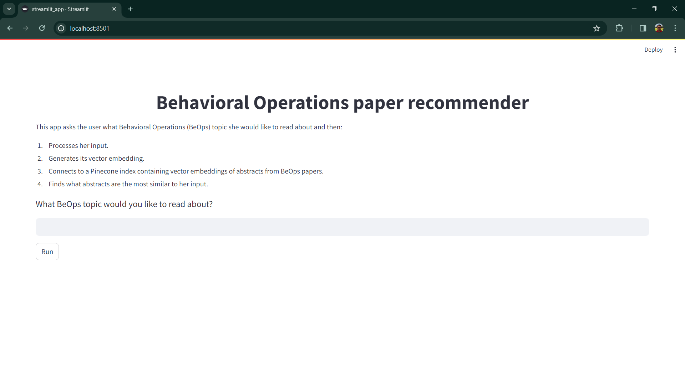
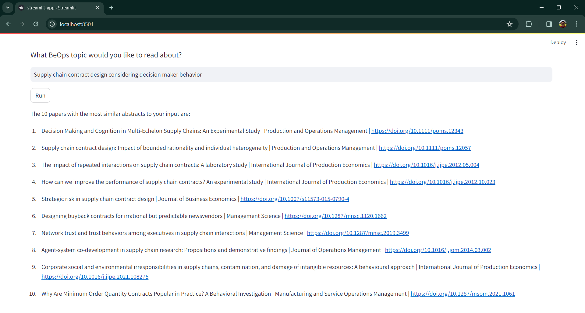

# NLP recommender of Behavioral Operations papers

This repo provides the code of a `Streamlit` app that:

1. receives an user's input about behavioral operations (BeOps) topics she would like to read about,
2. processes her input,
3. generates its vector embedding,
4. connects to a `Pinecone` index (i.e., vector database) containing vector embeddings of abstracts from BeOps papers, and
5. finds what abstracts are the most similar to her input.

The app is available at [nba-analysis-jaime.streamlit.app](https://nba-analysis-jaime.streamlit.app/). At the moment of deployment, the `Pinecone` index contains vector embeddings from 282 abstracts. The embeddigns were generated using a `TF-IDF` vectorizer with dimension equal to 128 using unigrams and bigrams. The papers were retrieved in late October using the `Scopus Search API` with the following search terms:

```python
KEY = "\"behavio*ral operations\""
SUBJAREA = 'BUSI'
SRCTYPE = 'j'
PUBYEAR = '2023'
PUBYEAR_OPERATOR = '<'
query = "KEY(" + KEY + ") AND SUBJAREA(" + SUBJAREA + ") AND SRCTYPE(" + SRCTYPE + ") AND PUBYEAR " + PUBYEAR_OPERATOR + " " + PUBYEAR
```

That is, the API searches publications with the following criteria:

- **behavioral operations** (or behavioural operations) is part of the keywords,
- the subject area is **Business, Management and Accounting**,
- the source type are **journals**, and
- they were published **before 2023**.

For more information about the `Scopus Search API`, please refer to the following websites from the [Elsevier Developer Portal](https://dev.elsevier.com/):

- [Scopus Search API](https://dev.elsevier.com/documentation/SCOPUSSearchAPI.wadl)
- [Scopus Search Guide](https://dev.elsevier.com/sc_search_tips.html)

## Getting started

Please make sure to install Python and the project requirements. The requirements are listed in the file `requirements.txt` and can be installed in a Linux terminal with the following command:[^1]

[^1]: Note the `python -m` at the beggining of the command. While running `pip` this way inside a virtual environment is not necessary, it's good practice to run it this way. See [Why you should use `python -m pip`](https://snarky.ca/why-you-should-use-python-m-pip/) for an explanation about running `pip` with and without `python -m`.

```bash
python -m pip install -r requirements.txt
```

You can do the same with the file `dev-requirements.txt`. This file lists some linting and code formatting libraries that can be used with a source-code editor like VS Code.

## Scripts

The app works with six Python scripts stored in the folder **src**.

### streamlit_app.py

This script contains the frontend code based on `Streamlit`. The interface looks like shown in Figure 1:

<p style="line-height:0.5" align="center">
    
</p>
<p style="line-height:0.5" align="center"><b>Figure 1.</b> Streamlit app interface.</p>

The user must enter a prompt about what BeOps topics she would like to read about. Once she hits **Run**, the app prepares the prompt for the vectorization, loads the `TF-IDF` vectorizer used to vectorize the abstracts, vectorizes the prompt, connects to `Pinecone` and queries the index to find what abstracts are the most similar to the prompt. The app shows the top 10 papers, retrieving for each its title, journal and Digital Object Identifier (DOI).

The interface with the final results looks like shown in Figure 2:

<p style="line-height:0.5" align="center">
    
</p>
<p style="line-height:0.5" align="center"><b>Figure 2.</b> Streamlit app interface with results.</p>

### text_preparation.py

This script contains code that prepares the user input following common NLP tasks. Specifically, the code removes punctuation, lower cases the text, removes stopwords and lemmatizes the abstract. A specific step for this project is replacing hyphens, en-dashes and em-dashes with a blank space, which is performed before the other tasks.

### load_vectorizer.py

This script contains code that loads the `TF-IDF` vectorizer used to vectorize the abstracts. The vectorizer was fitted with a dimension equal to 128 using unigrams and bigrams.

### vector_database.py

This script contains code that connects to the `Pinecone` index that stores the vector embeddings from the 282 abstracts.

### config.py

This script contains code that loads supporting credential data used by `vector_database.py` to connect to `Pinecone`.

I use Streamlit Secrets Management (SSM) to manage credential data. When using SSM, you need to create (i) a folder named `.streamlit` in the folder **src** and (ii) a file inside `.streamlit` named `secrets.toml` with the following data:[^3]

```toml
PINECONE_API_KEY = "PINECONE_API_KEY"
PINECONE_ENVIRONMENT = "PINECONE_ENVIRONMENT"
PINECONE_TABLE = "PINECONE_TABLE"
```

[^3]: When implementing your own app, please make sure to replace the placeholders accordingly.

This file is used during local development using the Python scripts. When deploying the app, you need to define these variables as environment variables in your app's **Advanced settings...** Please check [SSM's documentation](https://docs.streamlit.io/streamlit-community-cloud/deploy-your-app/secrets-management) for an overview.

### load_data.py

This script contains code that loads papers' data stored in a CSV file. These data include title, authors, journal, publication year and DOI, among others.

Besides the vector embeddings, the `Pinecone` index stores a metadata field that contains the papers' DOIs, which are pulled when the index is queried. Thus, using these DOIs, the app queries the paper's data loaded from the CSV file to pull the papers' titles and journals.

## Future work

This is the first deployed version of the app. Several things I'm currently working on I'd like to incorporate are:

- **Use feature store for papers' data:** currently, papers' data are stored in a CSV file. While the amount of papers is relatively small, which makes the use of a CSV file more than enough, I plan to use a feature store to keep up to date with machine learning engineering practices.
- **Update papers database:** recall the current paper count is 282 papers. I plan to automate the use of the `Scopus Search API` to update the papers database with a given periodicity (e.g., once per month). This would also require to update the feature store every time the `Scopus Search API` is used (the local development using notebooks provides several examples of the use of this API). Moreover, the current search terms miss some relevant literature (e.g., several papers on the bullwhip effect). Thus, I also need to work on the search terms to not miss this literature.
- **Update vectorization**: as the amount of papers grows, the vector embeddigns should be revised. For example, in the current version, the vectors' dimension is 128 using unigrams and bigrams, which doesn't allow to capture some bigrams with particular BeOps concepts or ideas like *newsvendor model* and *bullwhip effect*. This would also require to update the `Pinecone` index. Moreover, I plan to enable an option to allow the user to choose between a `TF-IDF` and a `GloVe` vectorizer (the local development using notebooks provides an example of the use of a `GloVe` vectorizer).
- **Improve frontend:** The current frontend is simple since I wanted to deploy a minimum viable product using core features such as vector embeddigns and a vector database. I plan to improve the frontend by formatting results as a table and allowing some basic filtering (e.g., by journal).  

## Credits

This project was motivated by my interest in learning about NLP and LLM. The idea was adapted from [Pau Labarta Bajo's blog entry on NLP engineering](https://datamachines.xyz/2022/11/22/one-project-to-become-an-nlp-engineer/).

I highly appreciate feedback and you can reach out to me on [LinkedIn](https://bit.ly/jaime-linkedin) any time. I'm also working on other projects. Check this out in my [personal website](https://bit.ly/jaime-website).

Thanks for reading!
